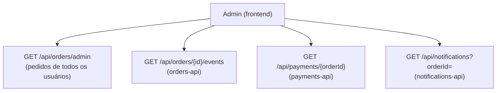

# Trilha de auditoria por pedido

Como a tela de admin compõe o histórico completo de um pedido a partir de quatro endpoints admin-only independentes — cada serviço devolvendo só o próprio dado, nunca uma junção entre schemas. Referenciado em `../architecture/ARCHITECTURE.en-US.md`/`.pt-BR.md` §6.

