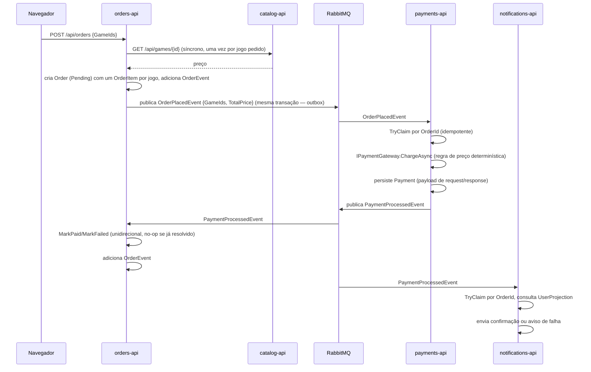

# Fluxo de compra

Do `POST /api/orders` até `Paid`/`Failed`: a leitura síncrona de preço no `catalog-api`, o outbox transacional publicando `OrderPlacedEvent`, a cobrança determinística no `payments-api`, e o `PaymentProcessedEvent` fechando o ciclo em `orders-api` e `notifications-api`. Referenciado em `../architecture/ARCHITECTURE.en-US.md`/`.pt-BR.md` §5.2.

