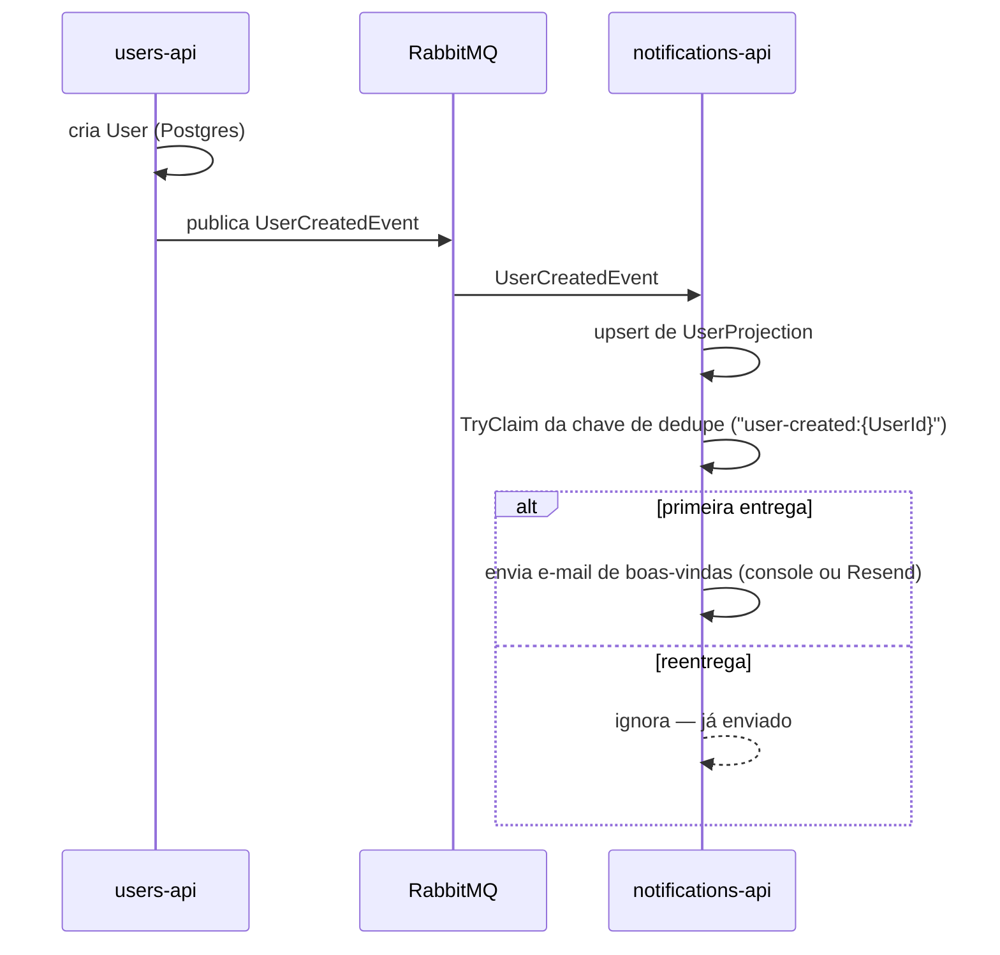

# Fluxo de cadastro

`UserCreatedEvent`, do cadastro até o e-mail de boas-vindas, com o dedupe do `notifications-api` cobrindo uma reentrega. Referenciado em `../architecture/ARCHITECTURE.en-US.md`/`.pt-BR.md` §5.1.

