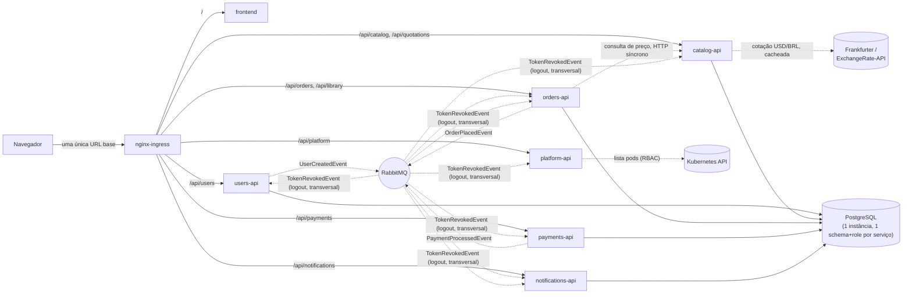

# Topologia dos serviços

Como uma requisição do navegador chega a cada serviço através do Ingress, e como os serviços se conectam entre si (leitura síncrona de preço, eventos via RabbitMQ, cada um com seu próprio schema no Postgres). Referenciado em `../architecture/ARCHITECTURE.en-US.md`/`.pt-BR.md` §1.

Estas setas não são mais só a forma orgânica do sistema — são também, literalmente, a lista de permissões de quatro recursos `NetworkPolicy` (`orchestration/templates/network-policy.yaml`), de fato aplicados pelo Calico desde que o CNI padrão do `kind` foi trocado (§8, `notes.md` 93). Qualquer conexão não desenhada aqui agora é de fato bloqueada, não só evitada por convenção.

