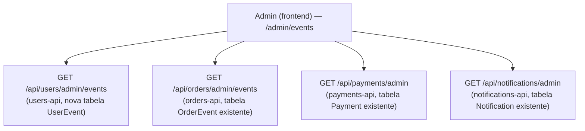

# Eventos de todo o sistema

Como a página `/admin/events` compõe a lista de "tudo o que já aconteceu" a partir de quatro endpoints admin "listar tudo" diferentes dos usados na trilha de auditoria por pedido. `catalog-api` está ausente aqui — não publica nem consome nada. Referenciado em `../architecture/ARCHITECTURE.en-US.md`/`.pt-BR.md` §6.

