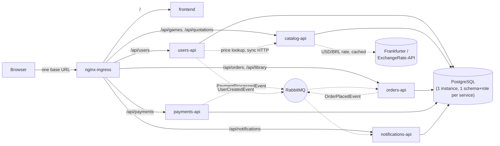
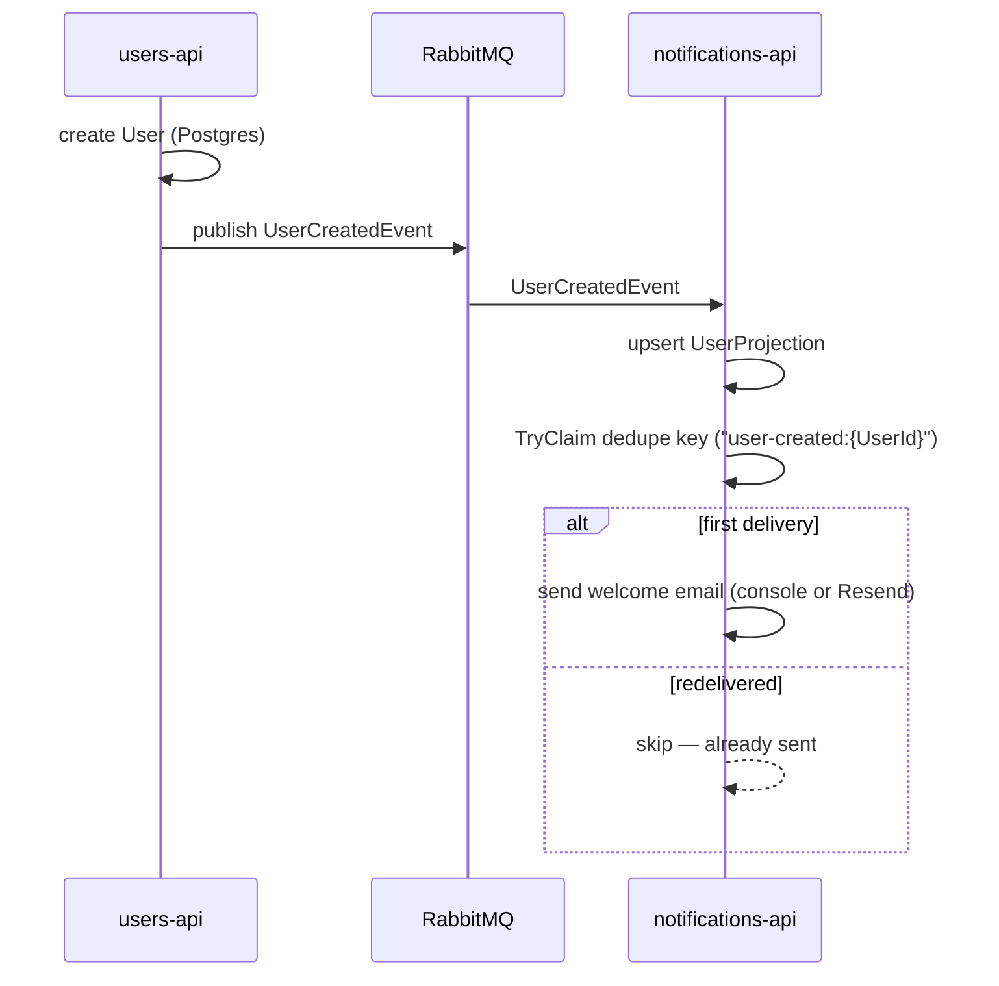
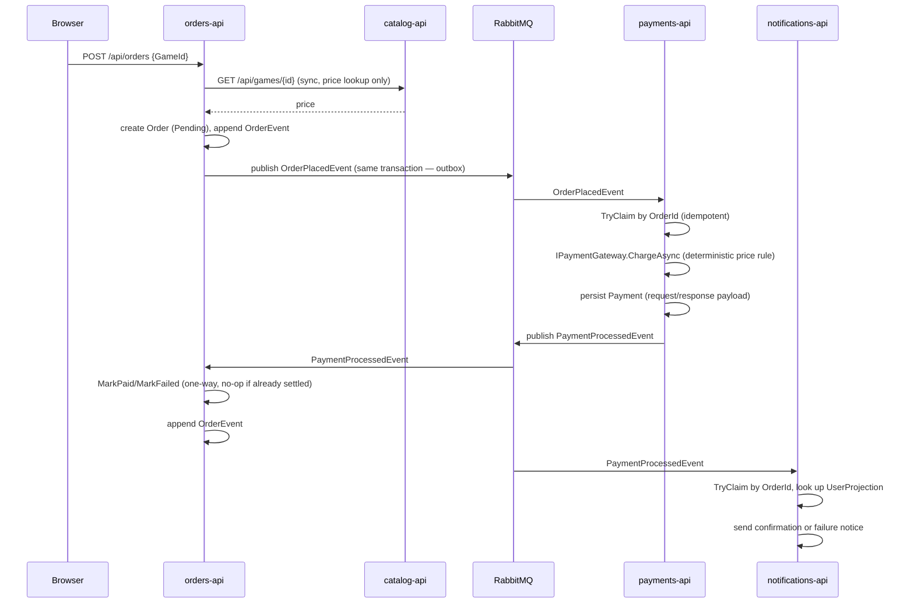
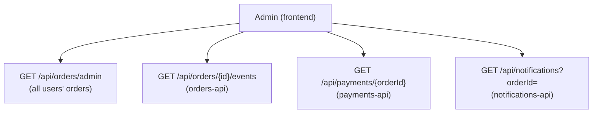
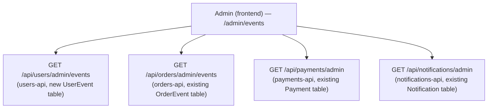

**English** · [Português](DOCUMENTATION.pt-BR.md)

# FIAP Games — Distributed System Documentation

## 1. Introduction

This document describes what was actually built when [`base-project/`](https://github.com/KainanGuerra/fiap-games) — a .NET modular monolith managing Users and Games — was rearchitected into a distributed system: five independently deployable services, an event-driven purchase flow, per-service data isolation, and a React frontend, all running on a local Kubernetes cluster.

The focus here is the same as [`base-project/docs/DOCUMENTATION.md`](https://github.com/KainanGuerra/fiap-games/blob/main/docs/DOCUMENTATION.md)'s: not just *what* was built, but *how*, and why it took the shape it did.

### Navigation

| File | Content |
|---|---|
| [`GETTING_STARTED.en-US.md`](GETTING_STARTED.en-US.md) | Prerequisites, cluster bring-up, verification, a demo walkthrough |
| [`instructions.md`](../spec/instructions.md) | The spec — architecture, service responsibilities, event contracts, acceptance criteria |
| [`notes.md`](../spec/notes.md) | Decision record — 50 entries, each with the rejected alternative and what would reopen it |
| [`bdd.md`](../spec/bdd.md) | Gherkin acceptance scenarios — the project's acceptance layer |
| [`frontend/design/`](https://github.com/tc2-fiap/frontend/tree/main/design) | Brand identity — color tokens, wordmark, logo mark, favicon (applied verbatim in the frontend) |
| [`base-project/docs/DOCUMENTATION.md`](https://github.com/KainanGuerra/fiap-games/blob/main/docs/DOCUMENTATION.md) | How the reference monolith this system replaces is built |

## 2. Why a distributed system, and how it was built

`base-project` already applied DDD (bounded contexts), Clean Architecture, and BDD within a single deployable. This project keeps all three practices but changes the *boundary*: each bounded context — Users, Catalog, Orders, Payments, Notifications — becomes its own repository, schema, and deployable, communicating with the others only through events (or, for the one case where synchronous consistency actually matters, a plain HTTP call).

That's a materially larger failure surface than a monolith: five services, a message broker, per-service databases, and Kubernetes manifests, instead of one process and one database. The build order was chosen specifically to manage that risk — a **walking skeleton** first (the narrowest possible path through every piece of infrastructure — cluster, Helm, Ingress, Postgres, RabbitMQ, structured logging — proven with `users-api` and `notifications-api` alone), then breadth (completing the simple services, proving cross-service JWT trust), then the actual core of the assignment (the purchase flow), then hardening against the acceptance criteria, then late-arriving features (admin RBAC and the cross-service audit trail), then the frontend, in that order. Integrating everything only after every service was "complete" was treated as the primary risk to avoid — see `notes.md`'s risk table.

## 3. Solution architecture

```
users-api/            # registration, login, Google sign-in, JWT issuance, roles
catalog-api/          # game catalog — product reference data only
orders-api/           # the Order aggregate, purchase lifecycle, library, audit log
payments-api/         # payment gateway abstraction, persisted payment records
notifications-api/    # welcome emails, purchase confirmations (console or Resend)
frontend/             # React + Vite — the only service reached by a browser directly; also owns design/, the brand assets
orchestration/        # Postgres, RabbitMQ, Ingress, umbrella Helm chart
```

Seven independent repos under [`github.com/tc2-fiap`](https://github.com/tc2-fiap), cloned as flat siblings — see `GETTING_STARTED.md` §1. `documentation` (this repo) is published separately (also `github.com/tc2-fiap/documentation`) and isn't part of that local layout — it's reference material, not something the running system or its build needs on disk (`notes.md` 47, 49).

Every one of these eight repos has its own `README.md` (`notes.md` 34, 44). Each backend repo follows the same internal layering `base-project`'s modules used — `Domain` → `Application` → `Infrastructure`, with `Endpoints` outermost, dependencies pointing inward — but as the *entire* repo's structure, not a module within a shared host. Framework-free kernel code (`Result`, `Entity`, `IRepository`, pagination) and JWT/error-handling infrastructure are **duplicated per service**, not packaged (`notes.md` 21) — five copies of ~13 small files, chosen over a shared NuGet package specifically to avoid reintroducing the coupling the split was meant to remove.



Every arrow into Postgres uses a role scoped to exactly one schema — a cross-schema query is refused by Postgres itself, verified live by attempting one with another service's credentials (`instructions.md` §14).

## 4. Domain model

| Service | Aggregate/entity | Key fields |
|---|---|---|
| `users-api` | `User` | Id, Name, Email (unique), PasswordHash (nullable — null for Google-only accounts), GoogleSubjectId, Role (`Player`/`Admin`) |
| `users-api` | `UserEvent` | Id, UserId, EventType, Payload (raw JSON), OccurredAtUtc — the system-wide event audit log (`notes.md` 43) |
| `catalog-api` | `Game` | Id, Title, Genre, Platform, Description, Price, ReleaseDate, CoverImageUrl (nullable — display only, see §7.3) |
| `orders-api` | `Order` | Id, UserId, GameId, Price (**snapshot**, never live), Status (`Pending → Paid \| Failed`, one-way) |
| `orders-api` | `OrderEvent` | Id, OrderId, EventType, Payload (raw JSON), OccurredAtUtc — the per-order audit log |
| `payments-api` | `Payment` | Id, OrderId (unique), UserId, GameId, Price, Status (`Processing`/`Approved`/`Rejected` — local only, never on the wire), Gateway, ExternalReference, RequestPayload, ResponsePayload, PixCopyPasteCode, PixQrCodeBase64 (both nullable — real PIX gateways only, see §7.3), NextPollAtUtc, PollAttempts |
| `notifications-api` | `Notification` | Id, DedupeKey (unique), Type, UserId, OrderId (nullable), Recipient, Subject, Body, Channel, Status, ProviderRequestPayload, ProviderResponsePayload |
| `notifications-api` | `UserProjection` | UserId (key), Name, Email — a local read-model, not a cross-service read (see §7) |

## 5. Technology stack

- **.NET 10**, ASP.NET Core Minimal APIs.
- **PostgreSQL** via EF Core/Npgsql — one instance, one schema and role per service (`notes.md` 13, 14).
- **RabbitMQ** via **MassTransit** — chosen over raw `RabbitMQ.Client` specifically for its EF Core transactional outbox (`notes.md` 12, 15, 22).
- **JWT** with a shared symmetric signing secret (`notes.md` 19) — `users-api` is the only issuer, every service validates independently.
- **Google Identity Services** (ID-token verification, not the OAuth redirect flow) for optional sign-in (`notes.md` 28).
- **FluentValidation**, **Serilog** (structured JSON logging), **BCrypt** for password hashing.
- **xUnit** + **NSubstitute** — every test is service-layer with mocked repositories; no live database or broker in any test suite.
- **React 19 + Vite + TypeScript**, `react-router-dom`, no UI framework — the frontend calls only relative `/api/*` paths.
- **A hand-rolled `LocaleContext`** (English/Portuguese UI toggle, mirroring the existing `AuthContext` pattern rather than adding an i18n library) and `Intl.NumberFormat` for price display, one formatter each for `pt-BR`/BRL and `en-US`/USD (`notes.md` 35, 36, 39) — every backend price is still a plain BRL `decimal`; the USD figure is a display-only conversion, never a value any service stores or trusts.
- **Helm** — a subchart per repo, an umbrella chart in `orchestration` (`notes.md` 20).
- **kind** — the local Kubernetes cluster (`notes.md` per the plan's environment prerequisite).
- **Docker Compose** — every service repo also runs standalone, independent of the cluster (`notes.md` 24).

## 6. Persistence

Unlike `base-project`'s schemaless MongoDB (index migrations only), this system uses ordinary **EF Core relational migrations** per service, each service's `__EFMigrationsHistory` table living inside its own schema. Migrations run automatically at container startup (`db.Database.Migrate()`), guarded by a `wait-for-postgres` init container on every DB-backed service — without it, a genuinely cold cluster start races Postgres and the service's process crashes before Postgres is ready to accept a connection (`notes.md` 25).

`orders-api` additionally carries **MassTransit's EF Core transactional outbox** tables (`InboxState`, `OutboxMessage`, `OutboxState`) in its own schema — the mechanism that makes the order write and its `OrderPlacedEvent` atomic (§7).

## 7. Event-driven communication

Two flows, both fixed contracts across services (`instructions.md` §8) — renaming or reshaping either casually breaks five services at once.

### 7.1 Registration



### 7.2 Purchase



The synchronous price read (§ Orders → Catalog) is a query that happens *before* the flow starts — the flow itself never blocks on another service once `OrderPlacedEvent` is published (`instructions.md` §6, §8). Before even that read, `OrderService.CreateAsync` checks `IOrderRepository.HasActiveOrderAsync(userId, gameId)` — a user who already owns the game (`Paid`) or has a purchase for it in flight (`Pending`) gets `409 Conflict`; a prior `Failed` order never blocks a retry (`notes.md` 42).

**Idempotency, concretely.** Every consumer above either checks a dedupe key before acting (`notifications-api`, both events) or is naturally idempotent by domain state (`orders-api`'s `MarkPaid`/`MarkFailed` no-op once the order has left `Pending`; `payments-api` checks for an existing `Payment` row before charging). Verified live with a throwaway MassTransit replay tool: redelivering any of these three events produces zero duplicate effects — no second email, no second `Payment` row, no order flipping backwards.

**When a real gateway is configured** (`PaymentGateway:Providers` includes `abacatepay` and/or `mercadopago`), step `P->>P: IPaymentGateway.ChargeAsync` above resolves through `PaymentGatewayChain` and can return `Processing` instead of a final outcome — `payments-api` still persists the `Payment` row but does **not** publish `PaymentProcessedEvent` yet. A background `PaymentStatusPollingService` then polls the real provider on an exponential backoff until it resolves (or times out into a forced `Rejected`), and publishes then. `Order` stays `Pending` the whole time from `orders-api`'s perspective — no event contract changed. See `notes.md` 38 for the full design, including why polling stands in for the webhook receiver that's built but currently dormant.

### 7.3 Quotation display and the checkout step (synchronous additions, no new events)

Two later, purely synchronous additions sit alongside the flows above without changing either event contract (`notes.md` 39, 40):

- **`GET /api/quotations/usd-brl`** (`catalog-api`) proxies a live USD→BRL rate — Frankfurter first, ExchangeRate-API as an automatic fallback, both keyless, the resolved rate cached in-memory for an hour. The frontend is the only consumer that converts anything: a game's stored BRL price is shown as USD only when the language toggle is English, degrading to native BRL if the rate is unavailable. `Game.Price`/`Order.Price`/`Payment.Price` never change meaning — this is display-only, end to end.
- **`GET /api/payments/checkout/{orderId}`** (`payments-api`) is a second, player-facing route alongside the existing admin-only `GET /api/payments/{orderId}` — any authenticated user can call it for their *own* order (ownership checked against `Payment.UserId`, a mismatch returns `404`), getting back a narrow view (status, gateway, price, and — only when a real PIX gateway produced one — a QR image and copy-paste code) rather than the admin route's full raw gateway payloads. The frontend's existing `/orders/:orderId` page is the checkout step that consumes it: a product line item (fetched separately from `catalog-api`, since `Order` itself carries no game details beyond `GameId`), the dual-currency price, and — while `Pending` and a real gateway is active — the PIX QR block. With the default `simulated` gateway there's nothing to scan; the order still settles on its own via the existing polling/delay mechanism.

## 8. RBAC and the cross-service admin audit trail

Added after the core purchase flow (`notes.md` 26–30, 32), once the requirement surfaced that an admin needs to see, for any order, its full lifecycle across all three services that touch it — not just a summary.

`users-api` seeds one `Admin` account at startup from Secret-provided config (promotion needs an existing admin, so the first one can't be self-service); every other admin is promoted via `PUT /api/users/{id}/role`. Every admin endpoint is `RequireAuthorization(Roles: "Admin")` — confirmed live to return `403` for a non-admin token and `401` unauthenticated.

The audit view is **composed at the view layer, never joined at the database layer** — cross-schema queries stay refused. Four independent admin-only endpoints, each returning its own service's data with the *actual* payload exchanged, not a summary:



The one new architectural piece this required: `notifications-api`'s `UserProjection`, a local read-model kept current from `UserCreatedEvent`, because `PaymentProcessedEvent`'s fixed contract carries only a `UserId` and this service needs an email address to actually send to (`notes.md` 30).

**System-wide events, not just one order (`notes.md` 43).** The per-order view above answers "what happened to this order" — it doesn't answer "show me every `UserCreatedEvent` ever published." A second admin page, `/admin/events`, does that: filterable by source, kind, type, and date range, composed the same way from four *different* admin-only "list all" endpoints:



Only `users-api` needed a new table (`UserEvent`) — it was the one service with no record at all that `UserCreatedEvent` had been published. `orders-api`, `payments-api`, and `notifications-api` already had a table with everything needed (`OrderEvent`, `Payment`, `Notification` respectively); each just gained a new unscoped, paginated query over data it already persisted. `catalog-api` is absent from both diagrams — it publishes and consumes nothing.

## 9. Quality: tests, error handling, and observability

- **109 backend tests** across five services (users 18, catalog 17, orders 17, payments 52, notifications 5), every one service-layer with a mocked repository — no live Postgres or RabbitMQ in any suite. `payments-api`'s deterministic price rule is tested at the exact `999.00` boundary; `AbacatePayGateway`/`MercadoPagoGateway`'s provider-vocabulary mapping and PIX QR field extraction, `PaymentGatewayChain`'s fallthrough behavior, `PaymentStatusPollingWorker`'s backoff/timeout logic, and `catalog-api`'s `QuotationService` fallback/caching are all covered too (HTTP mocked via a fake `HttpMessageHandler`, no live sandbox calls — see `notes.md` 38, 39).
- **Global exception handling**: identical `GlobalExceptionHandler` (copied per service) catches anything unhandled, logs it in full server-side, and returns a generic `ProblemDetails` response with a trace id — never a stack trace to the client.
- **Structured logging**: every service emits one JSON log line per request (Serilog + `CompactJsonFormatter`), and every publish/consume logs `{OrderId}` (or `{UserId}` for registration) as a named property — confirmed live that a single `OrderId` traces a purchase across `orders-api`, `payments-api`, and `notifications-api`'s logs.
- **Result pattern**: every expected failure (not found, conflict, unauthorized, validation) is a `Result`/`Result<T>`, mapped to an HTTP status by the shared `ToHttpResult()` extension — never an exception for a case the caller should reasonably expect.

## 10. Deployment

- **Helm**: one subchart per repo (`Chart.yaml`, `values.yaml`, `templates/`), `orchestration` as the umbrella chart depending on all six (`notes.md` 20).
- **kind**: the local cluster, configured with `extraPortMappings` and the `ingress-ready` node label so nginx-ingress can bind host ports 80/443 directly.
- **Ingress routing** (single base URL):

  | Path | Service |
  |---|---|
  | `/api/users/*` | `users-api` |
  | `/api/games/*`, `/api/quotations/*` | `catalog-api` |
  | `/api/orders/*`, `/api/library` | `orders-api` |
  | `/api/payments/{orderId}`, `/api/payments/admin` | `payments-api`, admin-only; `/api/payments/checkout/{orderId}` is a separate, player-facing, ownership-checked route on the same prefix (`notes.md` 40); `/api/payments/webhooks/{provider}` is built and wired but dormant — this local topology confirms real gateway charges by polling, not webhook, see `notes.md` 38 |
  | `/api/notifications/*` | `notifications-api` (admin-only) |
  | `/*` | `frontend` |

- **Secrets audit**: `helm template | grep -iE "password\|secret\|apikey"` surfaces literal values only inside `Secret` resources themselves — every `Deployment` env var referencing one uses `secretKeyRef`, confirmed across all six charts.
- **Two runtime environments** (`notes.md` 24): every backend repo also carries its own `docker-compose.yml`, bringing up that service plus only the infrastructure it alone needs, so it's independently developable without the cluster.

## 11. CI/CD

Each of the six repos carries its own `.github/workflows/ci.yml`, adapted from [`base-project/.github/workflows/ci-cd.yml`](https://github.com/KainanGuerra/fiap-games/blob/main/.github/workflows/ci-cd.yml)'s two-job shape: `build-and-test` (restore/build/test for .NET repos, install/lint/build for the frontend) runs on every push and PR; `docker-build-and-push` runs only on a push to `main`, after the first job passes, publishing to GHCR. None of these executed during the build itself — this workspace's root was never `git init`'d for its duration, deliberately. Since then, all seven runtime repos were published individually to GitHub under a dedicated org, `tc2-fiap` (`notes.md` 47). Each initially defaulted to a `master` branch (`git init`'s local default) while this trigger is scoped to `main`, so CI silently never fired on any of them — every repo's default branch was renamed to `main` shortly after specifically to fix that (`notes.md` 48), and CI now runs on every push. `documentation` (this repo) was published later still, directly on `main`, but carries no CI workflow of its own (`notes.md` 49).

## 12. Deliverables

- Five independently deployable, independently tested backend services and a React frontend, each with its own Dockerfile, Helm subchart, and standalone `docker-compose.yml`.
- An event-driven purchase flow spanning three services with a transactional outbox, verified for both outcomes (`Approved`/`Rejected`) and for idempotent redelivery.
- Per-service Postgres schema isolation, enforced by role grants and verified live by a refused cross-schema query.
- An admin role with a cross-service audit trail composed from four independent endpoints, and optional Google sign-in and real email delivery, both gracefully degrading to "off" when unconfigured.
- A single-command cluster bring-up (`helm install`) verified with zero restarts from a genuinely clean state.
- A written specification (`instructions.md`), a 50-entry decision record (`notes.md`), and Gherkin acceptance scenarios (`bdd.md`).
- Bilingual (English/Portuguese) narrative documentation — this document, `GETTING_STARTED.md`, and every repo's `README.md` — and an English/pt-BR language toggle in the frontend itself; every price is still a BRL `decimal` end-to-end, shown as R$ or converted to a display-only USD figure depending on the toggle (`notes.md` 35, 36, 39).
- A real checkout step with a product summary, a dual-currency price, and a PIX QR code/copy-paste code when a real gateway is active — plus a duplicate-purchase guard so a game already owned or in flight can't be bought twice (`notes.md` 40, 42).
- A second admin view, `/admin/events`, listing and filtering every event/message across all five services — not scoped to one order — composed from four admin "list all" endpoints the same way the per-order audit trail is (`notes.md` 43).

## 13. Conclusion

The same three practices that shaped `base-project` — DDD, Clean Architecture, BDD — carried over unchanged; what changed was the unit they were applied to, from a module inside one process to five independently deployable services trusting each other only through events and a shared JWT secret. The walking-skeleton build order, the transactional outbox, and the per-schema Postgres isolation were the three decisions that made that split survivable rather than merely aspirational — each verified live against the running system, not just asserted in a document.
