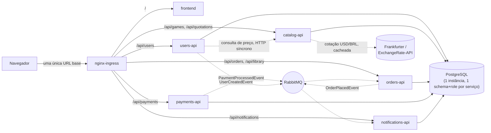
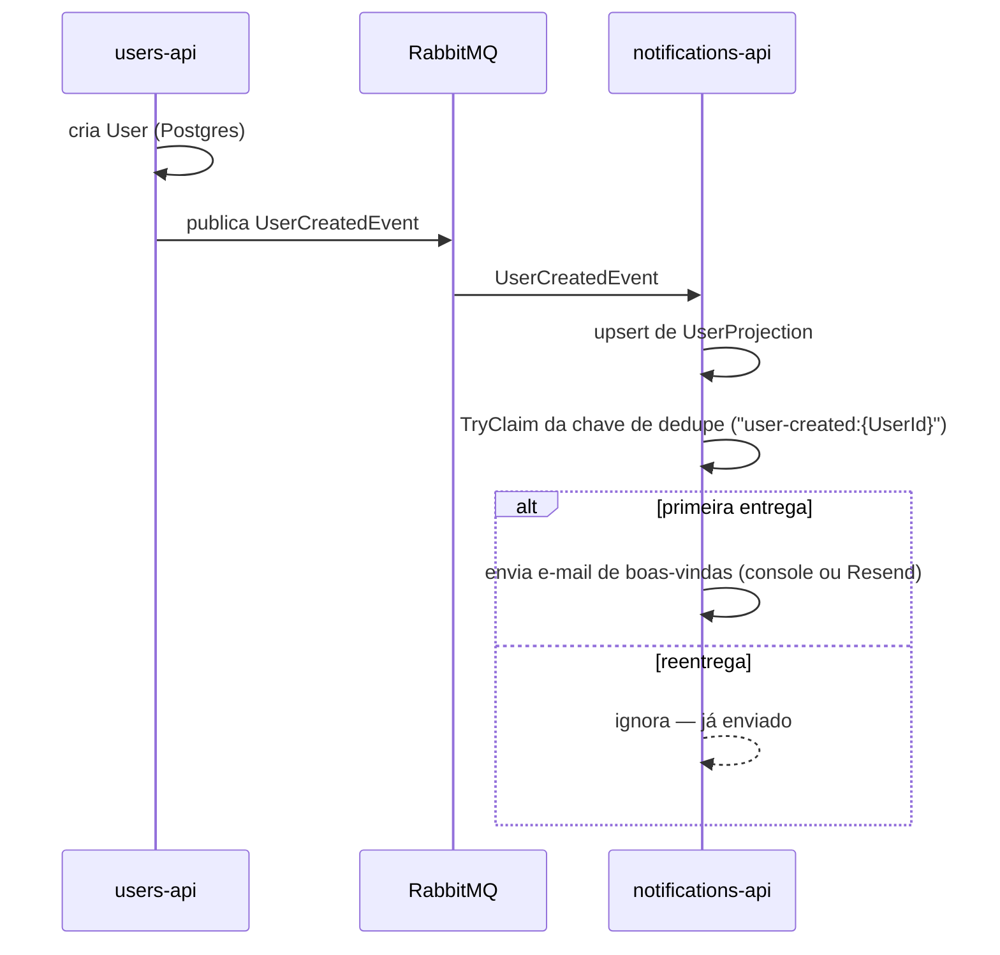
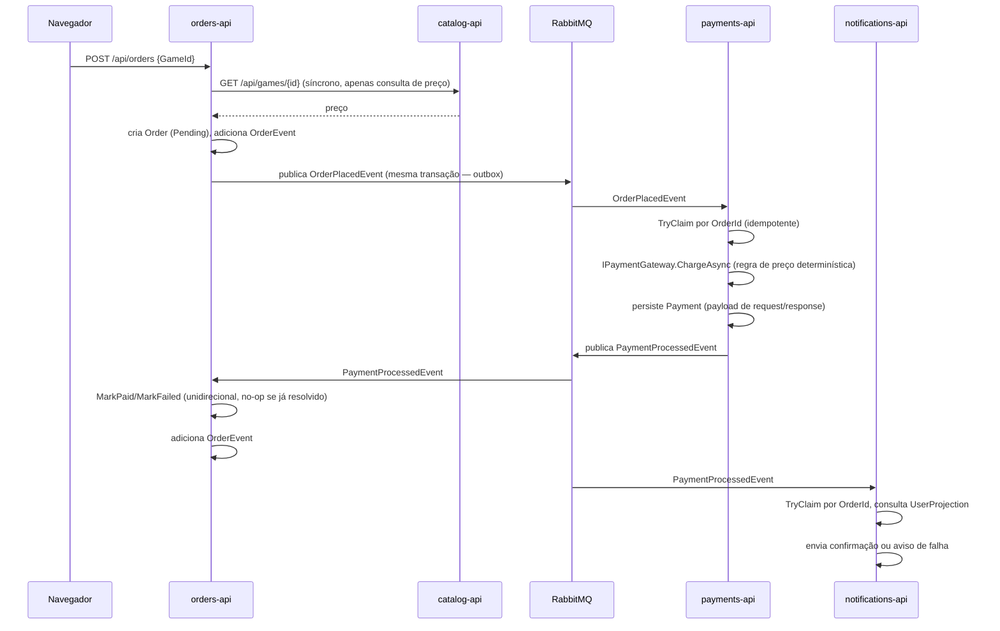
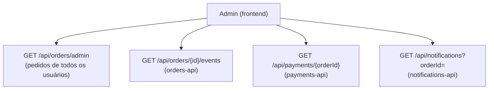
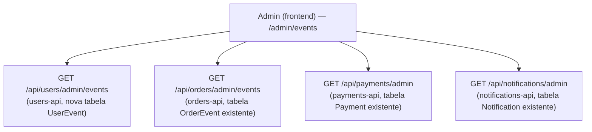

[English](DOCUMENTATION.en-US.md) · **Português**

# FIAP Games — Documentação do Sistema Distribuído

## 1. Introdução

Este documento descreve o que foi efetivamente construído quando o [`base-project/`](https://github.com/KainanGuerra/fiap-games) — um monólito modular em .NET responsável por Usuários e Jogos — foi rearquitetado como um sistema distribuído: cinco serviços implantáveis de forma independente, um fluxo de compra orientado a eventos, isolamento de dados por serviço e um frontend em React, tudo rodando em um cluster Kubernetes local.

O foco aqui é o mesmo do [`base-project/docs/DOCUMENTATION.md`](https://github.com/KainanGuerra/fiap-games/blob/main/docs/DOCUMENTATION.md): não apenas *o quê* foi construído, mas *como*, e por que tomou essa forma.

### Navegação

| Arquivo | Conteúdo |
|---|---|
| [`GETTING_STARTED.pt-BR.md`](GETTING_STARTED.pt-BR.md) | Pré-requisitos, subida do cluster, verificação, um passo a passo de demonstração |
| [`instructions.md`](../spec/instructions.md) | A especificação — arquitetura, responsabilidades de cada serviço, contratos de eventos, critérios de aceitação (em inglês) |
| [`notes.md`](../spec/notes.md) | Registro de decisões — 47 entradas, cada uma com a alternativa rejeitada e o que a reabriria (em inglês) |
| [`bdd.md`](../spec/bdd.md) | Cenários de aceitação em Gherkin — a camada de aceitação do projeto (em inglês) |
| [`../../frontend/design/`](../../frontend/design/) | Identidade visual — tokens de cor, marca, logomarca, favicon (aplicados literalmente no frontend) |
| [`base-project/docs/DOCUMENTATION.md`](https://github.com/KainanGuerra/fiap-games/blob/main/docs/DOCUMENTATION.md) | Como o monólito de referência que este sistema substitui foi construído |

## 2. Por que um sistema distribuído, e como foi construído

O `base-project` já aplicava DDD (contextos delimitados), Clean Architecture e BDD dentro de um único deployável. Este projeto mantém as três práticas, mas muda a *fronteira*: cada contexto delimitado — Usuários, Catálogo, Pedidos, Pagamentos, Notificações — passa a ser seu próprio repositório, schema e deployável, comunicando-se com os demais apenas por eventos (ou, no único caso em que a consistência síncrona realmente importa, por uma chamada HTTP simples).

Essa é uma superfície de falha materialmente maior que a de um monólito: cinco serviços, um message broker, bancos de dados por serviço e manifests Kubernetes, em vez de um único processo e um único banco. A ordem de construção foi escolhida especificamente para gerenciar esse risco — primeiro um **walking skeleton** (o caminho mais estreito possível por toda a infraestrutura — cluster, Helm, Ingress, Postgres, RabbitMQ, logging estruturado — comprovado apenas com `users-api` e `notifications-api`), depois amplitude (completando os serviços mais simples, provando a confiança JWT entre serviços), depois o núcleo real do projeto (o fluxo de compra), depois o endurecimento contra os critérios de aceitação, depois funcionalidades que surgiram mais tarde (RBAC de admin e a trilha de auditoria entre serviços), depois o frontend, nessa ordem. Integrar tudo apenas depois que cada serviço estivesse "completo" foi tratado como o principal risco a evitar — ver a tabela de riscos do `notes.md`.

## 3. Arquitetura da solução

```
repos/
  documentation/        # README (raiz) + narrative/ (este documento, GETTING_STARTED.md) + spec/ (instructions.md, notes.md, bdd.md) + features/
  users-api/           # cadastro, login, login com Google, emissão de JWT, papéis
  catalog-api/          # o catálogo de jogos — apenas dado de referência de produto
  orders-api/           # o agregado Order, o ciclo de vida da compra, a biblioteca, o log de auditoria
  payments-api/         # abstração do gateway de pagamento, registros de pagamento persistidos
  notifications-api/    # e-mails de boas-vindas, confirmações de compra (console ou Resend)
  frontend/             # React + Vite — o único serviço acessado diretamente pelo navegador; também guarda o design/, os ativos de marca
  orchestration/        # Postgres, RabbitMQ, Ingress, chart Helm guarda-chuva
```

Todo repositório sob `repos/` — os cinco serviços de backend, o `frontend`, o `orchestration` e o `documentation` — tem seu próprio `README.md` (`notes.md` 34, 44). Cada repositório de backend segue a mesma camada interna usada pelos módulos do `base-project` — `Domain` → `Application` → `Infrastructure`, com `Endpoints` na camada mais externa, dependências apontando para dentro — mas como a estrutura do repositório *inteiro*, não um módulo dentro de um host compartilhado. Código de kernel livre de framework (`Result`, `Entity`, `IRepository`, paginação) e infraestrutura de JWT/tratamento de erros são **duplicados por serviço**, não empacotados (`notes.md` 21) — cinco cópias de ~13 arquivos pequenos, escolha feita em vez de um pacote NuGet compartilhado especificamente para evitar reintroduzir o acoplamento que a separação pretendia eliminar.



Toda seta em direção ao Postgres usa um role restrito a exatamente um schema — uma consulta entre schemas é recusada pelo próprio Postgres, verificado ao vivo ao tentar uma com as credenciais de outro serviço (`instructions.md` §14).

## 4. Modelo de domínio

| Serviço | Agregado/entidade | Campos principais |
|---|---|---|
| `users-api` | `User` | Id, Name, Email (único), PasswordHash (anulável — nulo para contas somente-Google), GoogleSubjectId, Role (`Player`/`Admin`) |
| `users-api` | `UserEvent` | Id, UserId, EventType, Payload (JSON bruto), OccurredAtUtc — o log de auditoria de eventos de todo o sistema (`notes.md` 43) |
| `catalog-api` | `Game` | Id, Title, Genre, Platform, Description, Price, ReleaseDate, CoverImageUrl (anulável — só exibição, ver §7.3) |
| `orders-api` | `Order` | Id, UserId, GameId, Price (**snapshot**, nunca ao vivo), Status (`Pending → Paid \| Failed`, unidirecional) |
| `orders-api` | `OrderEvent` | Id, OrderId, EventType, Payload (JSON bruto), OccurredAtUtc — o log de auditoria por pedido |
| `payments-api` | `Payment` | Id, OrderId (único), UserId, GameId, Price, Status (`Processing`/`Approved`/`Rejected` — só interno, nunca trafega entre serviços), Gateway, ExternalReference, RequestPayload, ResponsePayload, PixCopyPasteCode, PixQrCodeBase64 (ambos anuláveis — só gateways PIX reais, ver §7.3), NextPollAtUtc, PollAttempts |
| `notifications-api` | `Notification` | Id, DedupeKey (único), Type, UserId, OrderId (anulável), Recipient, Subject, Body, Channel, Status, ProviderRequestPayload, ProviderResponsePayload |
| `notifications-api` | `UserProjection` | UserId (chave), Name, Email — um read-model local, não uma leitura entre serviços (ver §7) |

## 5. Stack tecnológico

- **.NET 10**, ASP.NET Core Minimal APIs.
- **PostgreSQL** via EF Core/Npgsql — uma instância, um schema e um role por serviço (`notes.md` 13, 14).
- **RabbitMQ** via **MassTransit** — escolhido em vez do `RabbitMQ.Client` bruto especificamente pelo seu outbox transacional com EF Core (`notes.md` 12, 15, 22).
- **JWT** com um segredo simétrico compartilhado (`notes.md` 19) — `users-api` é o único emissor, cada serviço valida de forma independente.
- **Google Identity Services** (verificação de ID token, não o fluxo de redirecionamento OAuth) para login opcional (`notes.md` 28).
- **FluentValidation**, **Serilog** (logging estruturado em JSON), **BCrypt** para hash de senha.
- **xUnit** + **NSubstitute** — todo teste é de camada de serviço com repositórios mockados; nenhum banco ou broker ao vivo em nenhuma suíte de testes.
- **React 19 + Vite + TypeScript**, `react-router-dom`, sem framework de UI — o frontend chama apenas caminhos relativos `/api/*`.
- **Um `LocaleContext` feito à mão** (alternância de UI Inglês/Português, espelhando o padrão já existente do `AuthContext` em vez de adicionar uma biblioteca de i18n) e `Intl.NumberFormat`, um formatador para `pt-BR`/BRL e outro para `en-US`/USD, para exibição de preços (`notes.md` 35, 36, 39) — todo preço no backend continua sendo um `decimal` em BRL; o valor em USD é uma conversão só para exibição, nunca um valor que algum serviço armazena ou confia.
- **Helm** — um subchart por repositório, um chart guarda-chuva em `orchestration` (`notes.md` 20).
- **kind** — o cluster Kubernetes local (`notes.md`, conforme o pré-requisito de ambiente do plano).
- **Docker Compose** — cada repositório de serviço também roda de forma independente, sem o cluster (`notes.md` 24).

## 6. Persistência

Diferente do MongoDB sem schema do `base-project` (apenas migrações de índice), este sistema usa **migrações relacionais comuns do EF Core** por serviço, com a tabela `__EFMigrationsHistory` de cada serviço vivendo dentro do seu próprio schema. As migrações rodam automaticamente na inicialização do container (`db.Database.Migrate()`), protegidas por um init container `wait-for-postgres` em todo serviço com banco — sem ele, uma subida verdadeiramente fria do cluster entra em corrida com o Postgres e o processo do serviço quebra antes que o Postgres esteja pronto para aceitar conexões (`notes.md` 25).

O `orders-api` também carrega as tabelas do **outbox transacional do MassTransit com EF Core** (`InboxState`, `OutboxMessage`, `OutboxState`) no seu próprio schema — o mecanismo que torna atômicos a escrita do pedido e o `OrderPlacedEvent` (§7).

## 7. Comunicação orientada a eventos

Dois fluxos, ambos contratos fixos entre serviços (`instructions.md` §8) — renomear ou remodelar qualquer um deles casualmente quebra cinco serviços de uma vez.

### 7.1 Cadastro



### 7.2 Compra



A leitura síncrona de preço (§ Orders → Catalog) é uma consulta que acontece *antes* do fluxo começar — o fluxo em si nunca bloqueia esperando outro serviço depois que o `OrderPlacedEvent` é publicado (`instructions.md` §6, §8). Antes até dessa leitura, o `OrderService.CreateAsync` verifica `IOrderRepository.HasActiveOrderAsync(userId, gameId)` — um usuário que já possui o jogo (`Paid`) ou tem uma compra em andamento para ele (`Pending`) recebe `409 Conflict`; um `Order` anterior `Failed` nunca bloqueia uma nova tentativa (`notes.md` 42).

**Idempotência, na prática.** Todo consumer acima ou verifica uma chave de dedupe antes de agir (`notifications-api`, nos dois eventos) ou é naturalmente idempotente pelo próprio estado do domínio (`MarkPaid`/`MarkFailed` do `orders-api` viram no-op assim que o pedido sai de `Pending`; `payments-api` verifica se já existe um `Payment` antes de cobrar). Verificado ao vivo com uma ferramenta descartável de replay do MassTransit: reentregar qualquer um desses três eventos produz zero efeitos duplicados — nenhum segundo e-mail, nenhum segundo `Payment`, nenhum pedido revertendo de estado.

**Quando um gateway real está configurado** (`PaymentGateway:Providers` inclui `abacatepay` e/ou `mercadopago`), o passo `P->>P: IPaymentGateway.ChargeAsync` acima passa a resolver via `PaymentGatewayChain` e pode retornar `Processing` em vez de um resultado final — o `payments-api` ainda persiste a linha `Payment`, mas **não** publica `PaymentProcessedEvent` ainda. Um `PaymentStatusPollingService` em background então consulta o provedor real com backoff exponencial até resolver (ou expirar em um `Rejected` forçado), publicando só então. O `Order` permanece `Pending` o tempo todo do ponto de vista do `orders-api` — nenhum contrato de evento mudou. Veja `notes.md` 38 para o design completo, incluindo por que o polling substitui o receptor de webhook, que está construído mas atualmente inativo.

### 7.3 Exibição da cotação e o checkout (adições síncronas, sem eventos novos)

Duas adições posteriores, puramente síncronas, convivem com os fluxos acima sem mudar nenhum dos dois contratos de evento (`notes.md` 39, 40):

- **`GET /api/quotations/usd-brl`** (`catalog-api`) faz proxy de uma cotação USD→BRL ao vivo — Frankfurter primeiro, ExchangeRate-API como fallback automático, ambos sem chave, com a cotação resolvida cacheada em memória por uma hora. O frontend é o único consumidor que converte algo: o preço em BRL de um jogo só é exibido em USD quando o idioma da interface está em inglês, voltando ao BRL nativo se a cotação estiver indisponível. `Game.Price`/`Order.Price`/`Payment.Price` nunca mudam de significado — isto é só exibição, do início ao fim.
- **`GET /api/payments/checkout/{orderId}`** (`payments-api`) é uma segunda rota, voltada ao jogador, ao lado da já existente `GET /api/payments/{orderId}` (admin-only): qualquer usuário autenticado pode chamá-la para o *próprio* pedido (posse verificada contra `Payment.UserId`; uma divergência retorna `404`), recebendo uma visão restrita (status, gateway, preço e — só quando um gateway PIX real gerou um — uma imagem de QR code e o código copia-e-cola) em vez dos payloads brutos completos da rota de admin. A página `/orders/:orderId` já existente no frontend é o passo de checkout que consome isso: um item de linha do produto (buscado separadamente no `catalog-api`, já que o `Order` em si não carrega nenhum detalhe do jogo além do `GameId`), o preço em duas moedas e — enquanto `Pending` e com um gateway real ativo — o bloco do QR code PIX. Com o gateway padrão `simulated` não há nada para escanear; o pedido ainda assim se resolve sozinho pelo mecanismo de polling/atraso já existente.

## 8. RBAC e a trilha de auditoria entre serviços

Adicionado depois do fluxo de compra principal (`notes.md` 26–30, 32), quando surgiu o requisito de que um admin precisa ver, para qualquer pedido, seu ciclo de vida completo nos três serviços que o tocam — não apenas um resumo.

O `users-api` semeia uma conta `Admin` na inicialização a partir de configuração vinda de um Secret (promoção exige um admin existente, então o primeiro não pode ser self-service); todo outro admin é promovido via `PUT /api/users/{id}/role`. Todo endpoint de admin é `RequireAuthorization(Roles: "Admin")` — confirmado ao vivo retornando `403` para um token não-admin e `401` sem autenticação.

A visão de auditoria é **composta na camada de visualização, nunca unida na camada de banco de dados** — consultas entre schemas continuam recusadas. Quatro endpoints independentes, admin-only, cada um retornando o dado do seu próprio serviço com o payload *real* trocado, não um resumo:



A única peça arquitetural nova exigida por isso: o `UserProjection` do `notifications-api`, um read-model local mantido atualizado a partir do `UserCreatedEvent`, porque o contrato fixo do `PaymentProcessedEvent` carrega apenas um `UserId`, e este serviço precisa de um endereço de e-mail para de fato enviar (`notes.md` 30).

**Eventos de todo o sistema, não só de um pedido (`notes.md` 43).** A visão por pedido acima responde "o que aconteceu com este pedido" — ela não responde "mostre todo `UserCreatedEvent` já publicado". Uma segunda página de admin, `/admin/events`, faz isso: filtrável por origem, tipo, categoria e intervalo de datas, composta da mesma forma a partir de quatro endpoints *diferentes* de admin "listar tudo":



Só o `users-api` precisou de uma tabela nova (`UserEvent`) — era o único serviço sem nenhum registro de que o `UserCreatedEvent` havia sido publicado. `orders-api`, `payments-api` e `notifications-api` já tinham uma tabela com tudo o que era necessário (`OrderEvent`, `Payment` e `Notification`, respectivamente); cada um só ganhou uma nova consulta paginada e sem escopo por pedido sobre dados que já persistia. O `catalog-api` está ausente dos dois diagramas — ele não publica nem consome nada.

## 9. Qualidade: testes, tratamento de erros e observabilidade

- **109 testes de backend** distribuídos entre cinco serviços (users 18, catalog 17, orders 17, payments 52, notifications 5), todos na camada de serviço com repositório mockado — nenhum Postgres ou RabbitMQ ao vivo em nenhuma suíte. A regra determinística de preço do `payments-api` é testada exatamente no limite de `999.00`; o mapeamento de vocabulário do `AbacatePayGateway`/`MercadoPagoGateway` e a extração dos campos do QR code PIX, o comportamento de fallback do `PaymentGatewayChain`, a lógica de backoff/timeout do `PaymentStatusPollingWorker` e o fallback/cache do `QuotationService` do `catalog-api` também têm cobertura (HTTP mockado via um `HttpMessageHandler` falso, nenhuma chamada real ao sandbox — veja `notes.md` 38, 39).
- **Tratamento global de exceções**: um `GlobalExceptionHandler` idêntico (copiado por serviço) captura qualquer coisa não tratada, registra tudo no lado do servidor e retorna um `ProblemDetails` genérico com um trace id — nunca um stack trace para o cliente.
- **Logging estruturado**: cada serviço emite uma linha de log JSON por requisição (Serilog + `CompactJsonFormatter`), e toda publicação/consumo registra `{OrderId}` (ou `{UserId}` no cadastro) como propriedade nomeada — confirmado ao vivo que um único `OrderId` rastreia uma compra pelos logs de `orders-api`, `payments-api` e `notifications-api`.
- **Padrão Result**: toda falha esperada (não encontrado, conflito, não autorizado, validação) é um `Result`/`Result<T>`, mapeado para um status HTTP pela extensão compartilhada `ToHttpResult()` — nunca uma exceção para um caso que o chamador deveria razoavelmente esperar.

## 10. Implantação

- **Helm**: um subchart por repositório (`Chart.yaml`, `values.yaml`, `templates/`), `orchestration` como o chart guarda-chuva dependendo de todos os seis (`notes.md` 20).
- **kind**: o cluster local, configurado com `extraPortMappings` e o label de nó `ingress-ready` para que o nginx-ingress possa se ligar diretamente às portas 80/443 do host.
- **Roteamento do Ingress** (uma única URL base):

  | Caminho | Serviço |
  |---|---|
  | `/api/users/*` | `users-api` |
  | `/api/games/*`, `/api/quotations/*` | `catalog-api` |
  | `/api/orders/*`, `/api/library` | `orders-api` |
  | `/api/payments/{orderId}`, `/api/payments/admin` | `payments-api`, admin-only; `/api/payments/checkout/{orderId}` é uma rota separada, voltada ao jogador e com verificação de posse, no mesmo prefixo (`notes.md` 40); `/api/payments/webhooks/{provider}` está construído e conectado, mas inativo — esta topologia local confirma cobranças de gateway real por polling, não por webhook; veja `notes.md` 38 |
  | `/api/notifications/*` | `notifications-api` (admin-only) |
  | `/*` | `frontend` |

- **Auditoria de secrets**: `helm template | grep -iE "password\|secret\|apikey"` só expõe valores literais dentro dos próprios recursos `Secret` — toda env var de `Deployment` que referencia um deles usa `secretKeyRef`, confirmado em todos os seis charts.
- **Dois ambientes de execução** (`notes.md` 24): todo repositório de backend também carrega seu próprio `docker-compose.yml`, subindo apenas aquele serviço mais a infraestrutura que ele sozinho precisa, tornando-o desenvolvível de forma independente, sem o cluster.

## 11. CI/CD

Cada um dos seis repositórios carrega seu próprio `.github/workflows/ci.yml`, adaptado do formato de dois jobs do [`base-project/.github/workflows/ci-cd.yml`](https://github.com/KainanGuerra/fiap-games/blob/main/.github/workflows/ci-cd.yml): `build-and-test` (restore/build/test para os repositórios .NET, install/lint/build para o frontend) roda em todo push e PR; `docker-build-and-push` roda apenas em push para `main`, depois que o primeiro job passa, publicando no GHCR. Nenhum deles rodou durante a construção em si — a raiz deste workspace nunca foi inicializada com `git init` durante essa fase, deliberadamente. Desde então, todos os seis repositórios (mais o `orchestration`) foram publicados individualmente no GitHub sob uma organização dedicada (`notes.md` 47) — mas os workflows ainda não rodaram, porque o branch padrão de cada repositório publicado saiu como `master` (padrão local do `git init`, nunca renomeado), enquanto o gatilho acima está restrito ao `main`.

## 12. Entregáveis

- Cinco serviços de backend implantáveis e testáveis de forma independente, e um frontend React, cada um com seu próprio Dockerfile, subchart Helm e `docker-compose.yml` independente.
- Um fluxo de compra orientado a eventos abrangendo três serviços com outbox transacional, verificado para os dois resultados (`Approved`/`Rejected`) e para reentrega idempotente.
- Isolamento de schema do Postgres por serviço, garantido por concessões de role e verificado ao vivo por uma consulta entre schemas recusada.
- Um papel de admin com trilha de auditoria entre serviços composta a partir de quatro endpoints independentes, e login com Google e envio real de e-mail opcionais, ambos degradando graciosamente para "desligado" quando não configurados.
- Subida do cluster em um único comando (`helm install`) verificada com zero reinícios a partir de um estado genuinamente limpo.
- Uma especificação escrita (`instructions.md`), um registro de decisões com 47 entradas (`notes.md`) e cenários de aceitação em Gherkin (`bdd.md`).
- Documentação narrativa bilíngue (inglês/português) — este documento, o `GETTING_STARTED.md` e o `README.md` de cada repositório — e uma alternância de idioma inglês/pt-BR no próprio frontend; todo preço continua sendo um `decimal` em BRL de ponta a ponta, exibido em R$ ou convertido para um valor em USD só de exibição, dependendo da alternância (`notes.md` 35, 36, 39).
- Um passo de checkout real com resumo do produto, preço em duas moedas e um QR code/código copia-e-cola PIX quando um gateway real está ativo — além de uma trava contra compra duplicada, para que um jogo já possuído ou em andamento não possa ser comprado de novo (`notes.md` 40, 42).
- Uma segunda visão de admin, `/admin/events`, listando e filtrando todo evento/mensagem entre os cinco serviços — não restrita a um pedido — composta a partir de quatro endpoints de admin "listar tudo", da mesma forma que a trilha de auditoria por pedido (`notes.md` 43).

## 13. Conclusão

As mesmas três práticas que moldaram o `base-project` — DDD, Clean Architecture, BDD — permaneceram inalteradas; o que mudou foi a unidade à qual foram aplicadas, de um módulo dentro de um único processo para cinco serviços implantáveis de forma independente, confiando uns nos outros apenas por meio de eventos e de um segredo JWT compartilhado. A ordem de construção em walking skeleton, o outbox transacional e o isolamento de schema do Postgres por serviço foram as três decisões que tornaram essa separação sustentável, e não apenas aspiracional — cada uma verificada ao vivo contra o sistema em execução, não apenas afirmada em um documento.
